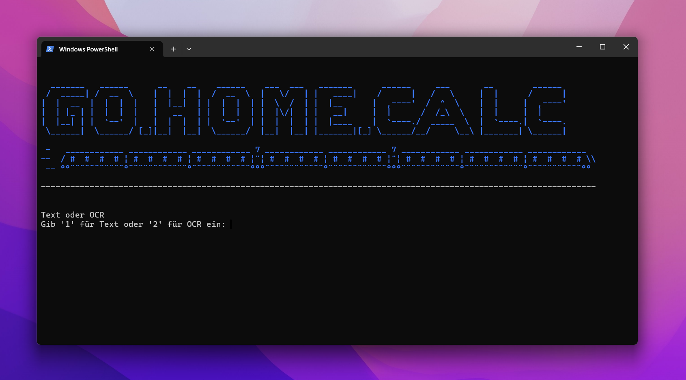

# GHC – TimeTool Arbeitszeitrechner mit ÖV-Integration

Dieses CLI-Tool berechnet deine effektive Arbeitszeit und zeigt dir basierend auf deinem Arbeitsende automatisch die passenden ÖV-Verbindungen an.

---

## 🚀 Funktionen

- Analyse von TimeTool-Zeiten (HH:MM-Format)
- Automatische Berechnung der effektiven Arbeitszeit
- Korrektur der Mittagspause (mindestens 30 Minuten)
- Berechnung der nötigen Endzeit basierend auf 8 Stunden
- Abruf der ÖV-Daten von transport.opendata.ch
- Ausgabe der nächsten vier Verbindungen Buchrain → Rotkreuz
- CLI-Interface mit ASCII-Banner

---

## 📷 Beispielansicht



---

## 🔧 Installation

```bash
py -m pip install requests
python test.py
```
## 🤝 Contributors
[carnevio (Nevio Carcanigiu)](https://github.com/carnevio)

[SCHschmidle](https://github.com/SCHschmidle)
