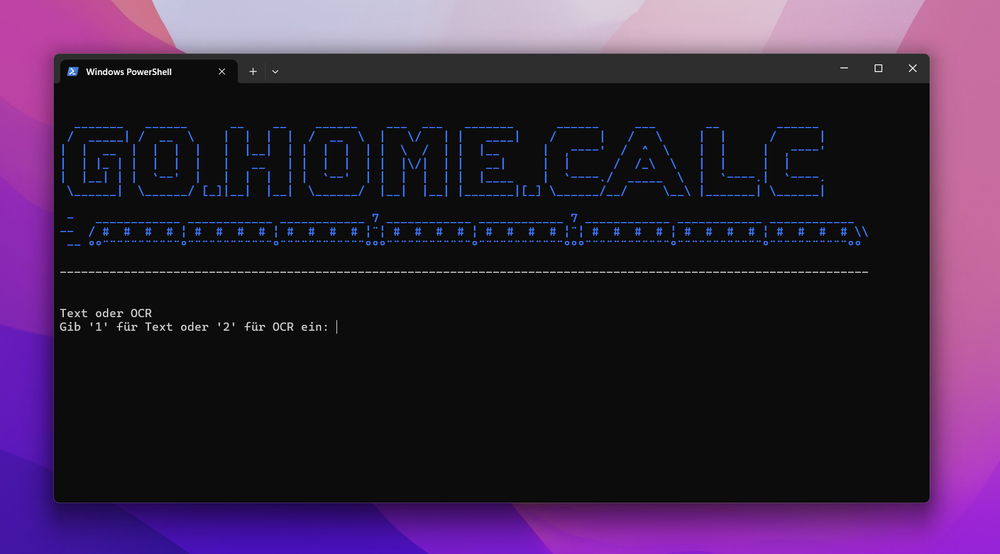

# GHC – TimeTool Arbeitszeitrechner mit ÖV-Integration

Dieses CLI-Tool berechnet deine effektive Arbeitszeit und zeigt dir basierend auf deinem Arbeitsende automatisch die passenden ÖV-Verbindungen an. Es unterstützt sowohl manuelle Eingaben als auch das automatische Einlesen von Arbeitszeiten via OCR.

---

## 🚀 Features

- **Manuelle Zeiteingabe**: Analyse von TimeTool-Zeiten (HH:MM-Format) via CLI-Eingabe.
- **Automatische Zeiterfassung via OCR**: Du kannst einen Screenshot deiner Arbeitszeiten aus der Zwischenablage direkt auslesen lassen!
- **Automatische Berechnung der effektiven Arbeitszeit** (inkl. Korrektur für Mindest-Mittagspause von 30 Min).
- **Arbeitsende-Rechner:** Zeigt an, wann du den Arbeitstag beenden darfst, damit du dein Pensum erfüllt hast.
- **Individuelle Profile:** Je nach Benutzername erfolgen automatische Anpassungen (z. B. Zielort für ÖV, Gehzeiten, etc.).
- **Ausgabe der nächsten ÖV-Verbindungen**: Abruf via transport.opendata.ch. Standardmäßig Buchrain → Rotkreuz oder individuell.
- **ASCII-Art-Ausgabe**: Banner und Arbeitsendzeit als stilisierte ASCII-Ziffern für mehr Übersicht und ein bisschen Fun.
- **Skriptvarianten für unterschiedliche Nutzer**: Mittels Auswahl können verschiedene Arbeitskontexte/Personalisierungen genutzt werden.
- **Batch-Starter**: Über `launch.bat` komfortabel unter Windows bedienbar: Es listet alle GHC-Skripte und startet auf Auswahl das gewünschte.
- **Menü-Abfrage (get_menus)**: Interaktives Auswahlmenü (get_menus) zum Starten und Konfigurieren der verfügbaren Skripte, Profile und Modi.


---

## 📷 Beispielansicht



---

## 📝 Bedienung

1. **Starte das gewünschte Skript**  
   Unter Windows nutze `launch.bat`, unter Unix/macOS das gewünschte Skript direkt.
2. **Art der Eingabe wählen**  
   Du wirst gefragt, ob du die Zeiten abtippen (`1`) oder via OCR/Clipboard importieren willst (`2`).
3. **Folge den Anweisungen**  
   Beim OCR-Modus stelle sicher, dass der Screenshot der Zeiten korrekt im Clipboard liegt.

---

## 🔧 Installation

```bash
pip install -r requirements.txt
python ghc/main.py
```

oder für die lightversion
```bash
python ghc/main_light.py
```

---


## 🤝 Contributors

[carnevio (Nevio Carcanigiu)](https://github.com/carnevio)  
[SCHschmidle](https://github.com/SCHschmidle)

---

  Stelle sicher, dass ein Bild im Clipboard ist und die nötigen Python-Pakete installiert sind.

---
